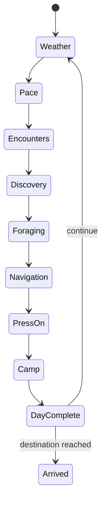

# Morelord Journeys: Module Design

Status: Initial product specification  
Target: Foundry Virtual Tabletop v14 only, with a D&D 5e adapter first

## Product definition

Morelord Journeys manages exploration workflow in the same way that Marketplace manages economy and Craftworks manages crafting. It turns travel into visible decisions, mechanical consequences, and persistent discoveries while automating sequencing and bookkeeping.

## Route model

Each route records:

| Rating | Meaning |
| --- | --- |
| Length | Required progress in thirds of a normal travel day |
| Danger | Frequency of potential encounters |
| Discovery | Difficulty of noticing optional discovery leads |
| Resources | Difficulty of finding food and water |
| Navigation | Difficulty of making progress without becoming lost |

Three integer progress steps equal one normal travel day. Slow, normal, fast, and stopped paces begin with 2, 3, 4, and 0 steps respectively. Weather, discoveries, pressing on, and route features add integer modifiers.

## Daily workflow

Every transition is explicit, persistent, and journaled. A journey may be closed and resumed during any phase.

## Automation boundary

Journeys automates phase order, arithmetic, modifier breakdowns, roll requests, supply calculations, table draws, logging, and optional time advancement. It asks before changing actor conditions, inventory, or world time. It does not automate combat, pathfinding, hex fog, or crafting and merchant rules.

## Integrations

- **Marketplace:** accepts supply requests and returns confirmed purchases to the journey manifest.
- **Craftworks:** accepts gathered materials and exposes crafted travel equipment modifiers.
- Both integrations are optional and communicate through a future public semantic API.

## Initial playable slice

A GM can create alternate routes to one destination, choose a route, assign travelers, and complete several travel days without manual progress arithmetic. The state survives reloads, every day records its decisions and consequences, and the GM can override generated results.

## Source boundary

The foundational route ratings, daily cadence, and tradeoff model are informed by *Jamjie's Travel Guide* by J. M. Gunnarsson. Journeys uses original interface text, data structures, examples, artwork, tables, and documentation. Source content is not bundled or reproduced without a separate license.
